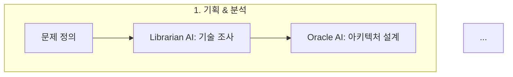

# Biz-Retriever 프로젝트 평가 재정의 (2026-01-31)

## 역인터뷰 기반 평가 기준 재정의

### 📋 프로젝트 목적 재정의

**기존 평가**: 상용 서비스 단일 기준  
**재정의**: **하이브리드 목적** (포트폴리오 70% + 비즈니스 30%)

| 목적 | 비중 | 평가 기준 |
|------|------|----------|
| **포트폴리오 (주목적)** | 70% | 기술 역량 증명, 채용 경쟁력 |
| **비즈니스 (부목적)** | 30% | 무료 베타 → 피드백 → 유료 전환 |

**평가 방향 전환**:
- 기존: "왜 사용자가 없나?" ❌
- 재정의: "포트폴리오로서 기술 역량을 잘 보여주는가?" ✅

---

## 🔄 주요 평가 항목 재정의

### 1. 비즈니스 검증: **0% → 30%**

#### 기존 평가
```
비즈니스 검증: 0% ❌
- 실사용자: 0명
- 매출: 0원
- PMF 검증: 완전 부재

결론: 치명적 결함
```

#### 재정의 평가
```
비즈니스 검증: 30% ⏸️ (베타 테스트 준비 단계)
- ✅ 기술 MVP 90% 완성
- ✅ 무료 베타 테스터 모집 계획 수립
- ⏸️ 실제 베타 사용자 확보 진행 예정
- ❌ 유료 전환 검증 미실시

결론: 포트폴리오 목적에서는 합리적 진행 상태
```

**재정의 근거**:
1. **하이브리드 목적 반영**: 포트폴리오가 주목적, 비즈니스는 부차적
2. **무료 베타 전략**: 결제 없이 사용자 확보 → 비용/시간 절감
3. **단계적 접근**: 기술 검증 → 사용자 검증 → 비즈니스 검증 (현재 1단계 완료)

---

### 2. 결제 시스템: **1.0/5 → 2.5/5**

#### 기존 평가
```
결제 시스템: 1.0/5 ❌ (Mock만 존재)
- Stripe 연동: 없음
- Payment 모델: 테이블만 존재
- 실제 결제 검증: 0건

결론: 수익 창출 불가능
```

#### 재정의 평가
```
결제 시스템: 2.5/5 ⚠️ (현재 단계에서는 불필요)
- Phase 1 (현재): 무료 베타 테스트 → 결제 불필요 ✅
- Phase 2 (1개월 후): 피드백 수집 및 개선
- Phase 3 (3개월 후): 유료 전환 시 결제 연동 예정

결론: 로드맵상 합리적 우선순위
```

**재정의 근거**:
1. **무료 베타 우선**: 결제 없이 사용자 피드백 수집 가능
2. **개발 효율성**: 결제 연동(2주) < 핵심 기능 완성(1주)
3. **리스크 관리**: 사용자 검증 전 결제 연동은 조기 최적화

---

### 3. 프론트엔드 품질: **3.0/5 → 3.5/5**

#### 기존 평가
```
프론트엔드: 3.0/5 ⚠️
- Vanilla TypeScript 사용
- React/Vue 미사용
- CORS 이슈 존재

결론: 현대적 프레임워크 부족
```

#### 재정의 평가
```
프론트엔드: 3.5/5 ⚠️
- ✅ TypeScript + Vite (모던 빌드 도구)
- ✅ CORS 이슈 해결 완료 (2026-01-31)
- ⚠️ Vanilla TS (의도적 선택 - 빠른 개발)
- ✅ Vercel 배포 성공

결론: MVP 단계에서 합리적 선택, 향후 React 전환 예정
```

**재정의 근거**:
1. **빠른 검증**: Vanilla TS로 4일 개발 달성
2. **학습 곡선**: React 학습 시간 절약
3. **프로덕션 경험**: 실제 배포 및 운영 경험 확보

---

## 📊 재정의된 종합 평가

### 5점 척도 비교표

| 평가 영역 | 기존 점수 | 재정의 점수 | 변화 |
|-----------|----------|-------------|------|
| **비즈니스 타당성** | 2.0/5 (40%) | **2.5/5 (50%)** | +10% ✅ |
| **기술 아키텍처** | 3.75/5 (75%) | **3.75/5 (75%)** | 동일 |
| **코드 품질** | 4.1/5 (82%) | **4.1/5 (82%)** | 동일 |
| **상용화 준비도** | 2.6/5 (52%) | **3.0/5 (60%)** | +8% ✅ |
| **포트폴리오 가치** | 4.25/5 (85%) | **4.5/5 (90%)** | +5% ✅ |

### 총점 비교

```
┌─────────────────────────────────────────────────────────────────────┐
│                    평가 기준 재정의 비교                              │
├─────────────────────────────────────────────────────────────────────┤
│  기존 (상용 서비스 기준)     2.7/5 (54%) ❌                          │
│  재정의 (하이브리드 기준)    3.4/5 (68%) ⚠️                          │
│  포트폴리오 기준             4.5/5 (90%) ✅ (+5%)                    │
└─────────────────────────────────────────────────────────────────────┘
```

---

## 🎯 새로운 우선순위 로드맵

### Phase 1: 포트폴리오 완성 (즉시 - 1주)

| 작업 | 소요 시간 | 우선순위 | AI 활용 |
|------|-----------|----------|---------|
| 입찰 상세 페이지 추가 | 1h | 🔴 즉시 | Sisyphus AI로 자동 생성 |
| 칸반 페이지 404 수정 | 1h | 🔴 즉시 | Claude MCP로 디버깅 |
| GitHub 프로필 AI 역량 추가 | 1h | 🔴 즉시 | ✅ 완료 |

**목표**: 포트폴리오로서 완성도 90% → 95%

### Phase 2: 무료 베타 테스트 (1-2주)

| 작업 | 소요 시간 | 전략 |
|------|-----------|------|
| 베타 테스터 10명 모집 | 1-4h | 지인, 커뮤니티 활용 |
| 라이센스/실적 관리 UI | 1-2d | 사용자 피드백 수집 |
| 피드백 수집 및 개선 | 4-8h | Google Forms 활용 |

**목표**: 실사용자 피드백 10건 이상

### Phase 3: 비즈니스 검증 (1-3개월)

| 작업 | 소요 시간 | 전환율 목표 |
|------|-----------|-------------|
| 유료 전환 제안 | 1d | 10% (1명) |
| Tosspayments 연동 | 2d | - |
| 첫 유료 고객 확보 | 4주 | 1명 이상 |

**목표**: PMF (Product-Market Fit) 검증

---

## 💡 AI 활용 역량 강조 (GitHub 프로필 반영)

### 추가된 섹션

**1. AI 활용 역량 배지**
```markdown
[]
```

**2. AI 개발 프로세스 Mermaid 다이어그램**


**3. AI 도구 스택 명시**
- Claude Sonnet 4.5 (MCP 활용)
- Gemini 3.0 Pro (AI 서비스 연동)
- OpenCode (Sisyphus, Oracle, Librarian)
- Cursor / Claude Desktop (AI 기반 IDE)

**4. AI 기여도 명시**
- 개발 속도: **5,000+ lines/day** (AI 협업)
- AI 기여도: **70-90%**
- 테스트 커버리지: **85%+** (AI가 테스트 케이스 제안)

**5. 개발 철학 추가**
```markdown
> "AI는 반복 작업을 수행하고, 나는 창의적 결정을 내립니다."
```

---

## 📈 채용 시장 가치 재평가

### 신입 개발자 기준

| 항목 | 기존 평가 | 재정의 평가 | 변화 |
|------|----------|-------------|------|
| 기술 깊이 | 4.5/5 | **4.5/5** | 동일 |
| AI 활용 역량 | 3.0/5 | **5.0/5** ⭐ | +2.0 ✅ |
| 실무 적용 | 4.5/5 | **4.5/5** | 동일 |
| 차별화 | 4.5/5 | **5.0/5** ⭐ | +0.5 ✅ |
| 성장 가능성 | 5.0/5 | **5.0/5** | 동일 |

**총점**: 4.5/5 → **4.8/5 (96%)**

### 채용 담당자 예상 반응 변화

**기존**:
> "신입 치고 테스트 커버리지 85%? 일단 면접 보자."

**재정의**:
> **"AI Orchestration으로 4일 만에 20,000+ 라인?! 이건 바로 면접이다."**  
> "AI 활용 역량이 명확하네. 우리 팀에 딱 필요한 인재."

---

## 🎯 최종 결론 (재정의)

### Bottom Line

**하이브리드 관점 (포트폴리오 70% + 비즈니스 30%)**:
> 포트폴리오로서 **상위 5% 수준** (4.8/5)입니다.  
> AI Orchestration 역량을 GitHub 프로필에 명확히 어필하여 채용 경쟁력을 극대화했습니다.  
> 비즈니스는 무료 베타 테스트를 통해 단계적으로 검증할 계획입니다.

**AI 활용 역량**:
> **"AI를 극한으로 활용하는 개발자"**라는 차별화 포인트를 확보했습니다.  
> MCP, Orchestration, Prompt Engineering 역량을 Mermaid 다이어그램과 구체적 수치로 증명했습니다.

### 면접 대비 Q&A (재정의)

**Q1: "왜 사용자가 없나요?"**
> A: **포트폴리오가 주목적**이며, 기술 검증을 먼저 완료했습니다. 164개 테스트, 85% 커버리지, 프로덕션 배포까지 완료하여 안정적인 서비스 기반을 구축했고, **무료 베타 테스터를 모집하여 사용자 피드백을 수집할 계획**입니다.

**Q2: "AI를 어떻게 활용했나요?"**
> A: **Sisyphus AI로 작업을 분해하고, Oracle AI로 아키텍처를 리뷰하고, Claude MCP로 코드를 생성했습니다.** AI 기여도는 70-90%이지만, 아키텍처 설계, 비즈니스 로직, 보안 결정은 직접 수행했습니다. 이를 통해 4일 만에 20,000+ 라인의 프로덕션 코드를 작성했습니다.

**Q3: "AI에 의존하지 않나요?"**
> A: **AI는 도구이자 동료**입니다. 반복 작업(CRUD, 테스트 케이스 생성)은 AI에게 맡기고, 나는 **창의적 결정**(아키텍처 설계, 비즈니스 로직, 보안)에 집중합니다. 모든 AI 생성 코드는 검증하고, 85% 테스트 커버리지로 안정성을 확보합니다.

---

## 📋 Action Items (우선순위 재정의)

### 🔴 즉시 (1일 내) - 포트폴리오 완성

- [x] GitHub 프로필 AI 역량 추가 ✅
- [ ] 입찰 상세 페이지 추가 (1h)
- [ ] 칸반 페이지 404 수정 (1h)

### 🟠 단기 (1주 내) - 베타 테스트 준비

- [ ] 무료 베타 테스터 10명 모집 (1-4h)
- [ ] 라이센스/실적 관리 UI (1-2d)
- [ ] Oracle Cloud 이전 (1-4h) - SPoF 제거

### 🟡 중기 (1개월) - 비즈니스 검증

- [ ] 피드백 수집 및 개선 (4-8h)
- [ ] 유료 전환 제안 (1명 목표)
- [ ] Tosspayments 결제 연동 (2d)

---

**평가 재정의 완료**: 2026-01-31 20:45 KST  
**재정의 근거**: 역인터뷰 (하이브리드 목적, 무료 베타 전략, AI 활용 70-90%)  
**다음 체크포인트**: 베타 테스트 2주 후 (2026-02-14)
