# Biz-Retriever Architecture Documentation

**Version**: 2.0 (Serverless)
**Last Updated**: 2026-02-03
**Status**: Production-Ready

---

## Table of Contents

1. [System Overview](#system-overview)
2. [Architecture Diagram](#architecture-diagram)
3. [Technology Stack](#technology-stack)
4. [Component Details](#component-details)
5. [Data Flow](#data-flow)
6. [Database Schema](#database-schema)
7. [Security Architecture](#security-architecture)
8. [Scalability Strategy](#scalability-strategy)
9. [Deployment Architecture](#deployment-architecture)

---

## System Overview

Biz-Retriever is a **serverless B2B SaaS platform** that automates bid announcement collection, AI-powered analysis, and intelligent matching for Korean SMEs. Built on Vercel's serverless infrastructure with Neon PostgreSQL and Upstash Redis.

### Core Capabilities

- **24/7 Automated Crawling**: G2B + OnBid API integration
- **AI Analysis**: Google Gemini 2.5 Flash for bid summarization and extraction
- **Smart Matching**: 3-step validation (region, license, performance)
- **Payment System**: Tosspayments integration with auto-renewal
- **Real-time Notifications**: Slack webhooks + morning digest

---

## Architecture Diagram

```mermaid
graph TB
    subgraph "Client Layer"
        FE[Frontend<br/>Vercel Static]
        USER[User Browser]
    end

    subgraph "API Layer - Vercel Serverless"
        AUTH[Auth APIs<br/>register, login, me]
        BIDS[Bid APIs<br/>list, detail, analyze, matched]
        PROFILE[Profile APIs<br/>CRUD + licenses + performances]
        KEYWORDS[Keywords APIs<br/>CRUD + exclude]
        PAYMENT[Payment APIs<br/>create, confirm, status]
        UPLOAD[Upload APIs<br/>PDF extraction]
        WEBHOOKS[Webhooks<br/>Tosspayments]
        CRON[Cron Jobs<br/>crawl, digest, renewal]
    end

    subgraph "Service Layer"
        RAG[RAG Service<br/>Gemini AI]
        MATCH[Match Service<br/>Hard Match]
        PAY[Payment Service<br/>Tosspayments]
        CRAWLER[Crawler Services<br/>G2B + OnBid]
        EMAIL[Email Service<br/>Notifications]
    end

    subgraph "External Services"
        GEMINI[Google Gemini<br/>2.5 Flash]
        TOSS[Tosspayments<br/>Payment Gateway]
        G2B[G2B API<br/>나라장터]
        ONBID[OnBid<br/>온비드]
        SLACK[Slack<br/>Webhook]
    end

    subgraph "Data Layer"
        NEON[(Neon PostgreSQL<br/>Serverless DB)]
        UPSTASH[(Upstash Redis<br/>Cache + Queue)]
    end

    USER --> FE
    FE --> AUTH
    FE --> BIDS
    FE --> PROFILE
    FE --> KEYWORDS
    FE --> PAYMENT
    FE --> UPLOAD

    AUTH --> NEON
    BIDS --> RAG
    BIDS --> MATCH
    BIDS --> NEON
    PROFILE --> NEON
    KEYWORDS --> NEON
    PAYMENT --> PAY
    UPLOAD --> RAG

    RAG --> GEMINI
    MATCH --> UPSTASH
    PAY --> TOSS
    CRAWLER --> G2B
    CRAWLER --> ONBID
    EMAIL --> SLACK

    WEBHOOKS --> PAY
    CRON --> CRAWLER
    CRON --> EMAIL
    CRON --> PAY

    CRAWLER --> NEON
    PAY --> NEON
    RAG --> NEON

    style FE fill:#00C7B7
    style AUTH fill:#3182f6
    style GEMINI fill:#4285F4
    style NEON fill:#4169E1
    style UPSTASH fill:#DC382D
```



---

## Technology Stack

### Frontend
- **Framework**: Vanilla JavaScript (SPA)
- **Design System**: Payhera/Naver/Kakao style
- **Hosting**: Vercel (Static)
- **CDN**: Vercel Edge Network

### Backend
- **Framework**: Vercel Serverless Functions (Python)
- **Format**: BaseHTTPRequestHandler (ASGI)
- **Concurrency**: asyncio + asyncpg
- **Environment**: Python 3.12

### Database
- **Primary**: Neon PostgreSQL (Serverless)
  - Connection Pooling: Built-in (pgbouncer=true)
  - Max Connections: Auto-scaling
  - Storage: Auto-scaling
- **Cache**: Upstash Redis
  - Use Case: Matched bids cache, rate limiting
  - TTL: 180s (matched bids)

### AI & ML
- **AI Model**: Google Gemini 2.5 Flash
- **Framework**: google-generativeai 0.3.2
- **Use Cases**:
  - Bid summarization
  - Keyword extraction
  - Region/license/performance parsing
  - Business certificate OCR

### Payment
- **Gateway**: Tosspayments
- **Methods**: Card, Bank Transfer
- **Features**: Billing key (auto-renewal), Webhook

### Notifications
- **Channel**: Slack Webhook
- **Frequency**: Real-time + Morning Digest (08:30 KST)

---

## Component Details

### 1. Authentication Layer

**Technology**: JWT (python-jose)

**Flow**:
```
User → Register/Login → JWT Token (60min)
                      ↓
                  Store in localStorage
                      ↓
                  Add to Authorization header
                      ↓
                  API validates token
```

**Token Structure**:
```json
{
  "sub": "user_id",
  "email": "user@example.com",
  "exp": 1234567890
}
```

**Security**:
- HS256 algorithm
- 60-minute expiration
- Refresh token: 30 days (future)

---

### 2. Bid Management System

#### Crawlers

**G2B Crawler**:
- Source: 나라장터 공공데이터 API
- Schedule: 09:00, 03:00, 09:00 UTC (Vercel Cron)
- Volume: ~50-100 bids/run
- Filters: Keywords, agency, date range

**OnBid Crawler**:
- Source: 온비드 웹사이트 (Selenium)
- Schedule: 23:00, 03:00, 09:00 UTC
- Volume: ~20-50 bids/run
- Filters: Rental only

**Deduplication**: Title + Agency hash

#### RAG Service (Gemini AI)

**Input**: Bid title + content + estimated price
**Output**:
```json
{
  "ai_summary": "한 문장 요약",
  "ai_keywords": ["키워드1", "키워드2"],
  "region_code": "11000",
  "license_requirements": ["건설업"],
  "min_performance": 30000000
}
```

**Prompt Template**:
```
다음 입찰 공고를 분석하여 JSON 형식으로 반환하세요:
- summary: 한 문장 요약
- keywords: 핵심 키워드 3-5개
- region_code: 지역 코드 (예: 11000)
- license_requirements: 필요 면허
- min_performance: 최소 실적 금액

공고 내용:
{title}
{agency}
{content}
{estimated_price}
```

**Cost**: Free tier (1,500 req/day)

#### Hard Match Engine

**3-Step Validation**:

1. **Region Match**:
   ```python
   bid.region_code[:2] == user.location_code[:2]
   # 예: "11000" (서울) matches "11" (서울특별시)
   ```

2. **License Match**:
   ```python
   required_licenses = bid.license_requirements
   user_licenses = [lic.license_name for lic in user.licenses]
   all(req in user_licenses for req in required_licenses)
   ```

3. **Performance Match**:
   ```python
   user_max_performance = max(perf.amount for perf in user.performances)
   user_max_performance >= bid.min_performance * 0.5  # 50% 기준
   ```

**Caching**: Redis (key: `matched_bids:user_{id}`, TTL: 180s)

**Plan Limits**:
- Free: 3 bids/day
- Basic: 50 bids/day
- Pro: Unlimited

---

### 3. Payment System

**Flow**:
```
1. Create Payment
   ↓
2. User pays on Tosspayments UI
   ↓
3. Tosspayments → Webhook (payment.confirmed)
   ↓
4. Update user subscription
   ↓
5. Send confirmation email
```

**Subscription Plans**:

| Plan | Price | Matched Bids | Keywords | Features |
|------|-------|--------------|----------|----------|
| Free | ₩0 | 3/day | 5 | Basic |
| Basic | ₩9,900/month | 50/day | 20 | AI Analysis |
| Pro | ₩29,900/month | Unlimited | 100 | Priority |

**Auto-Renewal**:
- Billing Key stored in DB
- Cron Job: Daily 02:00 UTC
- Retry: Max 3 attempts
- Email: Success/Failure/Cancellation

**Idempotency**:
```python
order_id = f"{timestamp}-USER{user_id}"
# Prevents duplicate payments
```

---

### 4. File Upload System

**PDF Processing**:
```
Upload PDF (사업자등록증)
    ↓
pymupdf extracts text
    ↓
Gemini AI extracts structured data
    ↓
Update user profile
```

**Extracted Fields**:
- company_name (상호)
- brn (사업자등록번호)
- representative (대표자명)
- address (사업장주소)

**Limits**:
- Max size: 10MB
- Format: PDF only
- Encrypted PDFs: Rejected (400)

---

## Data Flow

### User Registration Flow


### Bid Matching Flow


### Payment Flow


---

## Database Schema

```mermaid
erDiagram
    USERS ||--o{ BID_ANNOUNCEMENTS : creates
    USERS ||--o| USER_PROFILE : has
    USERS ||--o{ KEYWORDS : owns
    USERS ||--o{ PAYMENT_HISTORY : pays
    USERS ||--o| SUBSCRIPTION : has
    USER_PROFILE ||--o{ COMPANY_LICENSE : has
    USER_PROFILE ||--o{ COMPANY_PERFORMANCE : has

    USERS {
        int id PK
        string email UK
        string hashed_password
        string company_name
        datetime created_at
    }

    USER_PROFILE {
        int id PK
        int user_id FK
        string brn
        string representative
        string address
        string location_code
        string company_type
    }

    COMPANY_LICENSE {
        int id PK
        int profile_id FK
        string license_name
        string license_number
        date issue_date
    }

    COMPANY_PERFORMANCE {
        int id PK
        int profile_id FK
        string project_name
        float amount
        date completion_date
    }

    BID_ANNOUNCEMENTS {
        int id PK
        int user_id FK
        string title
        string agency
        decimal estimated_price
        date deadline
        string region_code
        json license_requirements
        decimal min_performance
        string ai_summary
        json ai_keywords
        int importance_score
    }

    KEYWORDS {
        int id PK
        int user_id FK
        string text
        string category
        boolean is_active
    }

    PAYMENT_HISTORY {
        int id PK
        int user_id FK
        decimal amount
        string status
        string payment_method
        string transaction_id
    }

    SUBSCRIPTION {
        int id PK
        int user_id FK UK
        string plan_name
        boolean is_active
        datetime next_billing_date
        string billing_key
    }
```

### Index Strategy

**High-Traffic Queries**:
```sql
-- Bid listing (most frequent)
CREATE INDEX idx_bids_deadline ON bid_announcements(deadline DESC);
CREATE INDEX idx_bids_region ON bid_announcements(region_code);
CREATE INDEX idx_bids_user_id ON bid_announcements(user_id);

-- User lookup
CREATE INDEX idx_users_email ON users(email);

-- Keyword filtering
CREATE INDEX idx_keywords_user_active ON keywords(user_id, is_active);

-- Payment tracking
CREATE INDEX idx_payment_user_status ON payment_history(user_id, status);
```

---

## Security Architecture

### 1. Authentication

**JWT Token**:
- Algorithm: HS256
- Secret: 32-byte random (from env)
- Expiration: 60 minutes
- Storage: localStorage (frontend)

**Password Security**:
- Hashing: bcrypt (cost factor 12)
- Validation: Min 8 chars, uppercase, lowercase, number, special char

### 2. Authorization

**Middleware**: `require_auth()`
```python
def require_auth(request):
    token = request.headers.get('Authorization')
    if not token:
        return send_error(request, 401, "Unauthorized")
    
    payload = verify_jwt(token)
    if not payload:
        return send_error(request, 401, "Invalid token")
    
    return payload  # {user_id, email}
```

### 3. API Security

**CORS**:
```json
{
  "Access-Control-Allow-Origin": "https://biz-retriever.vercel.app",
  "Access-Control-Allow-Methods": "GET, POST, PUT, DELETE, OPTIONS",
  "Access-Control-Allow-Headers": "Authorization, Content-Type"
}
```

**Rate Limiting** (Upstash Redis):
- Free: 100/hour, 1,000/day
- Basic: 1,000/hour, 10,000/day
- Pro: 10,000/hour, 100,000/day

### 4. Data Protection

**Encryption at Rest**:
- Database: Neon PostgreSQL (AES-256)
- Sensitive data: bcrypt hashing

**Encryption in Transit**:
- HTTPS only (TLS 1.3)
- Vercel automatic HTTPS

**Secrets Management**:
- Environment variables (Vercel Secrets)
- No hard-coded secrets
- `.env` excluded from git

### 5. Webhook Security

**Tosspayments Webhook**:
```python
expected_signature = hmac.new(
    webhook_secret.encode(),
    request.body,
    hashlib.sha256
).hexdigest()

if not hmac.compare_digest(expected_signature, received_signature):
    return 401  # Unauthorized
```

---

## Scalability Strategy

### 1. Serverless Auto-Scaling

**Vercel Functions**:
- Auto-scale: 0 → 1000+ instances
- Cold start: ~500ms
- Warm: ~50ms
- Memory: 1GB per function

**Concurrency**:
- Max concurrent: 100 (Hobby), 1000 (Pro)
- Per-function: 1 request at a time

### 2. Database Scaling

**Neon PostgreSQL**:
- Connection pooling: Built-in (pgbouncer)
- Auto-pause: Inactive databases sleep
- Branching: Dev/staging/prod isolation

**Query Optimization**:
- Indexes on high-traffic columns
- Pagination (LIMIT/OFFSET)
- Redis caching (180s TTL)

### 3. Caching Strategy

**Redis Cache**:
```
matched_bids:user_{id}:sort_{sort_by} → TTL 180s
```

**Cache Invalidation**:
- Manual: Profile update → clear matched bids
- Automatic: TTL expiration

### 4. Horizontal Scaling

**Current**: Single region (Vercel Edge)
**Future**:
- Multi-region deployment
- CDN for static assets
- Database read replicas

---

## Deployment Architecture

### Vercel Deployment

```
Git Push
    ↓
GitHub Webhook
    ↓
Vercel Build
    ├─ Frontend (Static)
    ├─ API Functions (Python)
    └─ Cron Jobs (Scheduled)
    ↓
Deploy to Edge Network
    ├─ Asia (Seoul, Tokyo)
    ├─ North America (SFO, NYC)
    └─ Europe (London, Frankfurt)
```

**Build Settings**:
```json
{
  "buildCommand": null,
  "outputDirectory": "frontend",
  "installCommand": "pip install -r requirements.txt",
  "framework": null
}
```

**Environment Variables** (Vercel Secrets):
```
DATABASE_URL
REDIS_URL
SECRET_KEY
GEMINI_API_KEY
TOSSPAYMENTS_SECRET_KEY
TOSSPAYMENTS_CLIENT_KEY
CRON_SECRET
SLACK_WEBHOOK_URL
```

### Monitoring & Observability

**Vercel Analytics**:
- Request count
- Response time (p50, p95, p99)
- Error rate
- Function duration

**Logging**:
- stdout → Vercel Logs
- Retention: 1 day (Hobby), 7 days (Pro)

**Alerts** (Future):
- Sentry for error tracking
- Slack notifications for failures

---

## Performance Metrics

**Target SLAs**:
- API response time: < 500ms (95th percentile)
- Cache hit rate: > 60%
- Uptime: 99.9%
- Error rate: < 1%

**Actual Performance** (Production):
- `/api/bids/list`: ~150ms (cached), ~800ms (uncached)
- `/api/bids/matched`: ~200ms (cached), ~1200ms (uncached)
- `/api/bids/{id}/analyze`: ~8s (Gemini AI)
- `/api/payment/create`: ~300ms

---

**Last Updated**: 2026-02-03
**Version**: 2.0 (Serverless)
**Status**: Production-Ready 🚀
